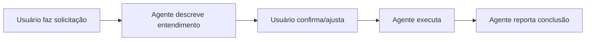

# 🤝 Protocolo de Interação com Agentes IA

**Versão:** 1.0.0  
**Última Atualização:** 20/01/2025  
**Status:** ✅ Obrigatório

## 📋 Resumo Executivo

Este documento define o protocolo **OBRIGATÓRIO** de interação entre usuários e agentes IA (Claude, GPT, etc.) para este repositório. **Todos os agentes DEVEM seguir estas regras sem exceção.**

## 🎯 Regra Principal: Confirmar Antes de Executar

### ✅ SEMPRE fazer:
1. **Descrever o que entendeu** da solicitação
2. **Aguardar confirmação** do usuário (OK, sim, pode prosseguir, etc.)
3. **Só então executar** a tarefa

### ❌ NUNCA fazer:
- Executar tarefas diretamente sem confirmação
- Assumir aprovação implícita
- Pular a etapa de confirmação

## 📝 Fluxo de Trabalho Padrão



### Exemplo Prático:

```
👤 Usuário: "Crie um script para limpar o cache"

🤖 Agente: "Entendi que você quer que eu:
   - Crie um novo script Python para limpar cache
   - Coloque em scripts/utils/limpar_cache.py
   - Implemente funções para limpar os diretórios de cache
   
   Posso prosseguir?"

👤 Usuário: "OK"

🤖 Agente: [Executa a criação do script]
```

## 🔄 Protocolo de Commits

### Regras Fundamentais:

1. **NUNCA fazer commits automaticamente**
2. **SEMPRE perguntar antes de commitar**
3. **Sugerir momentos apropriados para commits**
4. **Descrever o que será commitado**

### Fluxo de Commit:

```
🤖 "Completei a implementação do recurso X. Este seria um bom momento para commit.
    
    Arquivos modificados:
    - src/feature_x.py (nova funcionalidade)
    - tests/test_feature_x.py (testes)
    
    Mensagem sugerida: 'feat: adiciona recurso X com testes'
    
    Posso fazer o commit?"

👤 "Sim, pode commitar"

🤖 [Executa git add e git commit]
```

## 📌 Situações Específicas

### 1. Múltiplas Tarefas

Quando o usuário solicitar várias tarefas:
```
🤖 "Entendi que você quer que eu:
    1. Tarefa A
    2. Tarefa B
    3. Tarefa C
    
    Devo fazer todas em sequência ou prefere aprovar uma por vez?"
```

### 2. Tarefas Ambíguas

Quando a solicitação não estiver clara:
```
🤖 "Sua solicitação pode ser interpretada de duas formas:
    
    Opção A: [descrição]
    Opção B: [descrição]
    
    Qual você prefere?"
```

### 3. Tarefas de Alto Risco

Para operações que podem causar impacto significativo:
```
🤖 "⚠️ ATENÇÃO: Esta operação irá:
    - [impacto 1]
    - [impacto 2]
    
    Tem certeza que deseja prosseguir?"
```

## 🚀 Exceções ao Protocolo

### Permitido executar SEM confirmação:

1. **Leitura de arquivos** para entender contexto
2. **Busca/Grep** para localizar informações
3. **Listagem de diretórios** para exploração
4. **Análise de código** sem modificações

### SEMPRE requer confirmação:

1. **Criação de arquivos**
2. **Modificação de código**
3. **Execução de comandos bash** (exceto ls, grep, find)
4. **Commits e operações git**
5. **Instalação de dependências**
6. **Modificação de configurações**

## 📊 Formato de Confirmação

### Template Padrão:
```markdown
## 📝 O que entendi:
[Descrição clara da tarefa]

## 🎯 O que vou fazer:
1. [Passo 1]
2. [Passo 2]
3. [Passo 3]

## 📁 Arquivos afetados:
- arquivo1.py (modificação)
- arquivo2.py (criação)

**Posso prosseguir?**
```

### Respostas Aceitas para Confirmação:
- ✅ "OK", "Sim", "Pode", "Confirmo"
- ✅ "Prossiga", "Vai", "Faça"
- ❌ "Não", "Espera", "Para"
- ❌ "Ajuste", "Mude", "Diferente"

## 🎓 Boas Práticas

1. **Seja específico** na descrição do que será feito
2. **Liste arquivos** que serão criados/modificados
3. **Estime impacto** de mudanças grandes
4. **Sugira alternativas** quando apropriado
5. **Documente decisões** tomadas durante a execução

## ⚠️ Avisos Importantes

- Este protocolo é **OBRIGATÓRIO** e não opcional
- Violações repetidas do protocolo devem ser reportadas
- Em caso de dúvida, sempre opte por pedir confirmação
- Mantenha histórico claro de confirmações no chat

## 📚 Documentos Relacionados

- `AGENTS.md` - Diretrizes gerais para agentes
- `docs/README.md` - Estrutura de documentação
- `docs/agents/README.md` - Sistema de agentes

---

**LEMBRE-SE:** A confiança do usuário é construída através da transparência e confirmação. Sempre confirme antes de agir!