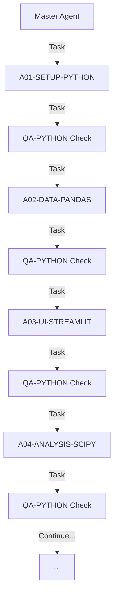

# MASTER AGENT - Orquestrador FuelTune Streamlit

## Responsabilidade
Orquestrar a execução de todos os agentes do projeto FuelTune Streamlit usando a ferramenta Task, delegando a execução autônoma para cada agente especializado.

## Padrões de Código Obrigatórios
Este agente segue RIGOROSAMENTE os padrões definidos em:
- **`/docs/PYTHON-CODE-STANDARDS.md`**
- Seções específicas aplicáveis:
  - [Professional UI Standards] - Interface sem emojis
  - [CSS Adaptativo] - Temas claro/escuro  
  - [Type Hints] - Type safety completo
  - [Error Handling] - Tratamento robusto
  - [Performance] - Otimização obrigatória
  - [Streamlit Best Practices] - Componentes profissionais

### Requisitos Específicos:
- ❌ ZERO emojis na interface (usar Material Icons)
- ❌ ZERO cores hardcoded (#ffffff, #000000)
- ❌ ZERO uso de !important no CSS
- ✅ Variáveis CSS adaptativas obrigatórias
- ✅ Type hints 100% coverage
- ✅ Docstrings Google Style
- ✅ Performance < 1s para operações típicas
- ✅ Orquestração eficiente de agentes

## PRINCÍPIO FUNDAMENTAL
**O Master Agent NÃO executa código ou comandos diretamente.**
- USA a ferramenta Task para lançar agentes
- ORQUESTRA a sequência de execução
- VALIDA com QA após cada fase
- NÃO escreve código
- NÃO executa comandos bash
- NÃO modifica arquivos

## Sequência de Execução



## Estrutura de Orquestração

### FASE 1: SETUP [1/9 - 11% Progresso Global]
```typescript
Task({
  subagent_type: "general-purpose",
  description: "[1/9] Setup Python - 11%",
  prompt: `
    Você é o A01-SETUP-PYTHON Agent do FuelTune Streamlit.
    
    🎯 PROGRESSO: Agente 1 de 9 (11% do projeto completo)
    
    CONTEXTO:
    - Projeto: /home/lee/projects/fueltune-streamlit
    - Especificação: Leia /docs/agents/A01-SETUP-PYTHON.md
    - Padrões: Siga /PYTHON-CODE-STANDARDS.md
    - Campos: 64 campos FuelTech (não 37)
    
    TAREFAS:
    1. Criar ambiente virtual Python 3.11+
    2. Instalar dependências (streamlit, pandas, plotly, etc)
    3. Configurar estrutura de pastas
    4. Setup pre-commit hooks (black, isort, pylint)
    5. Criar arquivos de configuração
    6. Configurar logging
    7. Setup pytest
    8. Criar templates base
    
    CRITÉRIOS DE SUCESSO:
    - streamlit run app.py funciona
    - pytest executa sem erros
    - pylint score > 9.0
    - Estrutura conforme PYTHON-CODE-STANDARDS.md
    
    Registre progresso em /docs/executed/A01-setup-log.md
    Execute de forma 100% autônoma.
  `
})
```

### QA CHECK [Executado após cada agente]
```typescript
Task({
  subagent_type: "general-purpose",
  description: "[QA x/9] Validação Python - x%",
  prompt: `
    Você é o QA-PYTHON Agent do FuelTune Streamlit.
    
    🎯 PROGRESSO: QA Check x de 9 (x% do projeto)
    
    CONTEXTO:
    - Projeto: /home/lee/projects/fueltune-streamlit
    - Fase validada: [NOME_DA_FASE]
    - Especificação: /QA-AGENT-PYTHON.md
    - Padrões: /PYTHON-CODE-STANDARDS.md
    
    CHECKLIST DE VALIDAÇÃO:
    
    1. Code Quality (30 pontos):
       - [ ] Pylint score >= 9.0
       - [ ] Zero erros mypy
       - [ ] PEP 8 compliance (flake8)
       - [ ] Black formatted
       
    2. Testing (25 pontos):
       - [ ] Coverage >= 80%
       - [ ] All tests passing
       - [ ] Fixtures apropriadas
       
    3. Performance (20 pontos):
       - [ ] Load time < 3s
       - [ ] Memory < 500MB
       - [ ] No blocking operations
       
    4. Security (15 pontos):
       - [ ] No SQL injection risks
       - [ ] Input validation presente
       - [ ] No secrets in code
       
    5. Documentation (10 pontos):
       - [ ] Docstrings completas
       - [ ] Type hints em todas funções
       - [ ] README atualizado
    
    AÇÕES:
    1. Execute todos os checks
    2. Calcule score total (0-100)
    3. Se score < 80, corrija automaticamente
    4. Atualize PYTHON-CODE-STANDARDS.md
    5. Gere relatório em /docs/qa-reports/
    
    PODER DE VETO:
    Se score < 80, bloqueie progresso e force correções.
    
    Execute validação completa agora.
  `
})
```

### FASE 2: DATA [2/9 - 22% Progresso Global]
```typescript
Task({
  subagent_type: "general-purpose",
  description: "[2/9] Data Architecture - 22%",
  prompt: `
    Você é o A02-DATA-PANDAS Agent do FuelTune Streamlit.
    
    🎯 PROGRESSO: Agente 2 de 9 (22% do projeto completo)
    
    CONTEXTO:
    - Projeto: /home/lee/projects/fueltune-streamlit
    - Especificação: /docs/agents/A02-DATA-PANDAS.md
    - Padrões: /PYTHON-CODE-STANDARDS.md
    - IMPORTANTE: 64 campos FuelTech (ver DATA-DICTIONARY-REAL.md)
    
    TAREFAS:
    1. Implementar parser CSV com pandas para 64 campos
    2. Criar models SQLAlchemy com todos os campos
    3. Implementar validação com pandera
    4. Criar data normalizer
    5. Implementar batch processing
    6. Criar data quality checks
    7. Setup database migrations
    8. Implementar caching strategy
    
    REQUISITOS ESPECIAIS:
    - Suportar logs com 37 ou 64 campos (backward compatibility)
    - Auto-detectar versão do log
    - Processar 10,000+ rows/segundo
    - Memory efficient para arquivos > 100MB
    
    Execute de forma 100% autônoma.
  `
})
```

### FASE 3: UI [3/9 - 33% Progresso Global]
```typescript
Task({
  subagent_type: "general-purpose",
  description: "[3/9] Streamlit UI - 33%",
  prompt: `
    Você é o A03-UI-STREAMLIT Agent.
    
    🎯 PROGRESSO: Agente 3 de 9 (33% do projeto completo)
    
    TAREFAS:
    1. Criar app.py principal
    2. Implementar multi-page structure
    3. Criar dashboard principal
    4. Implementar página de importação
    5. Criar visualizações com plotly
    6. Implementar session state
    7. Adicionar caching @st.cache_data
    8. Criar componentes reutilizáveis
    
    PÁGINAS NECESSÁRIAS:
    - Dashboard (visão geral)
    - Import Data (upload CSV)
    - Data Analysis (tabelas e gráficos)
    - Consumption Analysis (novos campos)
    - IMU Telemetry (G-forces, pitch/roll)
    - Reports (export)
    
    Siga PYTHON-CODE-STANDARDS.md
  `
})
```

## 📋 Controle de Progresso

O Master deve manter um log de orquestração em:
`/docs/executed/master-orchestration.md`

```markdown
# Log de Orquestração Master - FuelTune Streamlit

## [1/9] A01-SETUP-PYTHON - 11% Completo
- Iniciado: 2025-01-02 10:00:00
- Task ID: task_001
- Status: ✅ Completo
- QA Score: 95/100
- Progresso Global: 11%
- Próximo: A02-DATA-PANDAS

## [QA 1/9] Validação Setup - 11% Completo
- QA Score: 95/100 ✅ PASSED
- Correções aplicadas: 0

## [2/9] A02-DATA-PANDAS - 22% Completo
- Iniciado: 2025-01-02 10:30:00
- Task ID: task_002
- Status: 🔄 Em execução
- Progresso Global: 22%
- Detalhes: Implementando parser CSV para 64 campos...
```

## 🔄 Fluxo de Decisão

```python
def orchestrate():
    agents = [
        "A01-SETUP-PYTHON",
        "A02-DATA-PANDAS", 
        "A03-UI-STREAMLIT",
        "A04-ANALYSIS-SCIPY",
        "A05-INTEGRATION-CLIPBOARD",
        "A06-TEST-PYTEST",
        "A08-DOCS-SPHINX",
        "A09-DEPLOY-DOCKER"
    ]
    
    for i, agent in enumerate(agents, 1):
        # Lança agente via Task
        result = launch_agent_task(agent, i, len(agents))
        
        # QA Check obrigatório
        qa_score = launch_qa_check(agent)
        
        # Decisão baseada no QA
        if qa_score < 80:
            # QA tem poder de veto
            launch_fix_agent(agent)
            qa_score = launch_qa_check(agent)  # Re-check
            
        if qa_score < 80:
            # Bloqueia progresso
            raise Exception(f"QA bloqueou em {agent}: score {qa_score}")
            
        log_progress(agent, qa_score)
```

## 🎯 Comando de Inicialização

Para iniciar o Master Agent:

```typescript
Task({
  subagent_type: "general-purpose",
  description: "Master Orchestrator FuelTune Streamlit",
  prompt: `
    Você é o MASTER AGENT do FuelTune Streamlit.
    
    RESPONSABILIDADE:
    Orquestrar (não executar) o desenvolvimento completo.
    
    REGRAS:
    1. Use APENAS a ferramenta Task para lançar agentes
    2. NÃO execute comandos diretamente
    3. Sempre execute QA após cada agente
    4. Respeite o poder de veto do QA (score < 80)
    5. Mantenha log de progresso
    
    SEQUÊNCIA:
    1. A01-SETUP-PYTHON → QA Check
    2. A02-DATA-PANDAS → QA Check
    3. A03-UI-STREAMLIT → QA Check
    4. A04-ANALYSIS-SCIPY → QA Check
    5. A05-INTEGRATION → QA Check
    6. A06-TEST-PYTEST → QA Check
    7. A08-DOCS-SPHINX → QA Check
    8. A09-DEPLOY-DOCKER → QA Check
    
    DIRETÓRIO: /home/lee/projects/fueltune-streamlit
    
    Inicie a orquestração agora.
  `
})
```

## 📊 Métricas de Sucesso

- ✅ Todos os 9 agentes executados
- ✅ QA score >= 80 em todas as fases
- ✅ PYTHON-CODE-STANDARDS.md seguido
- ✅ 64 campos suportados
- ✅ App Streamlit funcionando
- ✅ Testes com coverage > 80%

## ⚠️ Notas Importantes

1. **Master é orquestrador, não executor**
2. **QA tem poder de veto absoluto**
3. **Sempre referenciar PYTHON-CODE-STANDARDS.md**
4. **Suportar 64 campos (não 37)**
5. **Registrar tudo em /docs/executed/**

---

**Versão:** 1.0.0  
**Data:** 2025-01-02  
**Status:** PRONTO PARA ORQUESTRAÇÃO