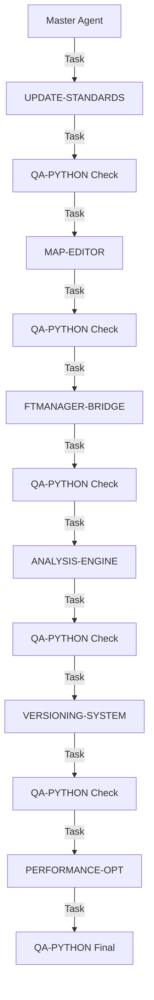

# MASTER AGENT - Orquestrador Features Faltantes FuelTune Streamlit

## Responsabilidade
Orquestrar a execução dos agentes para implementar os 65% de funcionalidades faltantes do FuelTune Streamlit usando a ferramenta Task, delegando a execução autônoma para cada agente especializado.

## Padrões de Código Obrigatórios
Este agente segue RIGOROSAMENTE os padrões definidos em:
- **`/docs/PYTHON-CODE-STANDARDS.md`**
- Seções específicas aplicáveis:
  - [Professional UI Standards] - Interface sem emojis
  - [CSS Adaptativo] - Temas claro/escuro  
  - [Type Hints] - Type safety completo
  - [Error Handling] - Tratamento robusto
  - [Performance] - Otimização obrigatória
  - [Implementation Guidelines] - Features críticas

## PRINCÍPIO FUNDAMENTAL
**O Master Agent NÃO executa código ou comandos diretamente.**
- USA a ferramenta Task para lançar agentes
- ORQUESTRA a sequência de execução
- VALIDA com QA após cada fase
- NÃO escreve código
- NÃO executa comandos bash
- NÃO modifica arquivos

## Contexto
- Sistema atual: **35% implementado** (apenas visualizador básico)
- Meta: **100% de paridade** com fueltune-react-tauri
- Estratégia: **Opção A - Completar Implementação**
- Timeline: **8-10 semanas com 2-3 desenvolvedores**
- ROI esperado: **6-8 meses**

## 📚 Padrões de Código Obrigatórios
Este agente master garante que TODOS os sub-agentes sigam:
- **`/docs/PYTHON-CODE-STANDARDS.md`** - Padrão obrigatório
- **`/docs/MISSING_FEATURES_SPECS.md`** - Especificações técnicas
- **`/docs/IMPLEMENTATION_GAPS.md`** - Gaps a resolver

### Enforcement de Qualidade:
- ❌ ZERO emojis na interface
- ❌ ZERO cores hardcoded
- ❌ ZERO código sem type hints
- ✅ Material Design Icons obrigatório
- ✅ CSS adaptativo claro/escuro
- ✅ Performance benchmarks obrigatórios
- ✅ Testes com coverage > 90%

## Sequência de Execução



## Estrutura de Orquestração

**Entregáveis:**
- [x] Padrões atualizados em PYTHON-CODE-STANDARDS.md
- [x] Agente de atualização criado
- [ ] Todos os agentes com referências aos padrões
- [ ] Ambiente preparado para desenvolvimento

### FASE 1: UPDATE-STANDARDS [1/6 - 40% Progresso das Features Faltantes]
```typescript
Task({
  subagent_type: "general-purpose",
  description: "[1/6] Update Standards - 40%",
  prompt: `
    Você é o UPDATE-ALL-AGENTS-WITH-STANDARDS Agent do FuelTune Streamlit.
    
    🎯 PROGRESSO: Agente 1 de 6 para features faltantes (40% das features faltantes)
    
    CONTEXTO:
    - Projeto: /home/lee/projects/fueltune-streamlit
    - Especificação: /docs/agents/pending/UPDATE-ALL-AGENTS-WITH-STANDARDS.md
    - Padrões: /docs/PYTHON-CODE-STANDARDS.md
    
    TAREFAS:
    1. Atualizar TODOS os agentes com referências aos padrões
    2. Adicionar seção de "Padrões de Código Obrigatórios"
    3. Remover emojis das interfaces
    4. Garantir referências a CSS adaptativo
    5. Adicionar checklists de qualidade
    
    CRITÉRIOS DE SUCESSO:
    - Todos agentes com seção de padrões
    - Zero emojis em códigos de interface
    - Referências claras ao PYTHON-CODE-STANDARDS.md
    
    Registre progresso em /docs/agents/executed/UPDATE-STANDARDS-LOG.md
    Execute de forma 100% autônoma.
  `
})
```

### FASE 2: MAP-EDITOR [2/6 - 50% Progresso das Features Faltantes]
```typescript
Task({
  subagent_type: "general-purpose",
  description: "[2/6] Map Editor 2D/3D - 50%",
  prompt: `
    Você é o IMPLEMENT-MAP-EDITOR Agent do FuelTune Streamlit.
    
    🎯 PROGRESSO: Agente 2 de 6 para features faltantes (50% das features faltantes)
    
    CONTEXTO:
    - Projeto: /home/lee/projects/fueltune-streamlit
    - Especificação: /docs/agents/pending/IMPLEMENT-MAP-EDITOR.md
    - Padrões: /docs/PYTHON-CODE-STANDARDS.md
    - CRITICO: Feature BLOCKER - sistema inútil sem isso
    
    TAREFAS:
    1. Criar estrutura src/maps/
    2. Implementar grid editável com AG-Grid
    3. Visualização 3D com Plotly
    4. Operações de suavização e interpolação
    5. Sistema de snapshots
    6. Integração clipboard
    7. Atalhos de teclado
    8. Performance < 100ms
    
    REQUISITOS ESPECIAIS:
    - ZERO emojis na interface
    - Material Design Icons apenas
    - CSS adaptativo obrigatório
    - Type hints 100% coverage
    - Compatibilidade FTManager
    
    Execute de forma 100% autônoma.
  `
})
```
**Tarefas:**
```python
tasks = {
    "week_1": [
        "Implementar grid editável com AG-Grid",
        "Validação de valores em tempo real",
        "Copy/paste de células",
        "Operações increment/decrement"
    ],
    "week_2": [
        "Visualização 3D com Plotly",
        "Preview de mudanças",
        "Undo/redo functionality",
        "Testes unitários"
    ]
}
```

### FASE 3: FTMANAGER-BRIDGE [3/6 - 60% Progresso das Features Faltantes]
```typescript
Task({
  subagent_type: "general-purpose",
  description: "[3/6] FTManager Integration - 60%",
  prompt: `
    Você é o IMPLEMENT-FTMANAGER-BRIDGE Agent do FuelTune Streamlit.
    
    🎯 PROGRESSO: Agente 3 de 6 para features faltantes (60% das features faltantes)
    
    CONTEXTO:
    - Projeto: /home/lee/projects/fueltune-streamlit
    - Especificação: /docs/agents/pending/IMPLEMENT-FTMANAGER-BRIDGE.md
    - Padrões: /docs/PYTHON-CODE-STANDARDS.md
    
    TAREFAS:
    1. Criar estrutura src/integration/
    2. Detecção de formato tab-delimited
    3. Parser para tabelas FTManager
    4. Export formatter
    5. Clipboard manager cross-platform
    6. Validação de compatibilidade
    7. Feedback profissional ao usuário
    
    REQUISITOS:
    - Zero perda de precisão
    - Compatibilidade 100% FTManager
    - Interface profissional sem emojis
    
    Execute de forma 100% autônoma.
  `
})
```
**Tarefas:**
```python
tasks = {
    "week_3": [
        "Detecção de formato tab-delimited",
        "Parser para tabelas FTManager",
        "Export formatter",
        "Validação de dimensões",
        "UI de import/export"
    ]
}
```

#### Semana 4: Polish e Testes
**Tarefas:**
```python
tasks = {
    "week_4": [
        "Integração completa Map Editor + FTManager",
        "Otimização de performance",
        "Testes de integração",
        "Documentação básica"
    ]
}
```

**Entregável Fase 1:** Sistema com editor de mapas funcional e integração FTManager

### 📅 Fase 2: Funcionalidades Core (Semanas 5-8)
**Objetivo:** Paridade com React/Tauri

### FASE 4: ANALYSIS-ENGINE [4/6 - 75% Progresso das Features Faltantes]
```typescript
Task({
  subagent_type: "general-purpose",
  description: "[4/6] Analysis Engine - 75%",
  prompt: `
    Você é o IMPLEMENT-ANALYSIS-ENGINE Agent do FuelTune Streamlit.
    
    🎯 PROGRESSO: Agente 4 de 6 para features faltantes (75% das features faltantes)
    
    CONTEXTO:
    - Projeto: /home/lee/projects/fueltune-streamlit
    - Especificação: /docs/agents/pending/IMPLEMENT-ANALYSIS-ENGINE.md
    - Padrões: /docs/PYTHON-CODE-STANDARDS.md
    
    TAREFAS:
    1. Criar estrutura src/analysis/
    2. Segmentação por estados do motor
    3. Binning adaptativo MAP×RPM
    4. Sistema de sugestões
    5. Confidence scoring
    6. Validações de segurança ±15%
    7. Numpy vectorization obrigatória
    8. Memory-efficient pandas
    
    REQUISITOS:
    - Performance < 1s para 10k pontos
    - Confidence scores normalizados 0-1
    - Interface profissional
    
    Execute de forma 100% autônoma.
  `
})
```
**Tarefas:**
```python
tasks = {
    "week_5": [
        "Segmentação por estados do motor",
        "Binning adaptativo MAP×RPM",
        "Análise de densidade de dados",
        "Cálculos estatísticos por célula"
    ],
    "week_6": [
        "Motor de sugestões",
        "Confidence scoring",
        "Ranking de prioridades",
        "Validação de segurança ±15%"
    ]
}
```

#### Semana 7: Versionamento e Snapshots
**Tarefas:**
```python
tasks = {
    "week_7": [
        "Sistema de snapshots no banco",
        "Comparação A/B de mapas",
        "Histórico de mudanças",
        "Rollback functionality"
    ]
}
```

#### Semana 8: Algoritmos Avançados
**Tarefas:**
```python
tasks = {
    "week_8": [
        "Suavização Gaussian",
        "Interpolação linear/cubic",
        "Edge preservation",
        "Otimizações numéricas"
    ]
}
```

**Entregável Fase 2:** Sistema com análise inteligente completa e versionamento

### 📅 Fase 3: Polish & Launch (Semanas 9-10)
**Objetivo:** v1.0 Production Ready

#### Semana 9: Otimização e Performance
**Tarefas:**
```python
tasks = {
    "week_9": [
        "Profiling e otimização",
        "Caching strategy",
        "Database indexes",
        "Memory optimization",
        "Load testing"
    ]
}
```

#### Semana 10: Beta Testing e Launch
**Tarefas:**
```python
tasks = {
    "week_10": [
        "Beta test com 10 usuários",
        "Bug fixes críticos",
        "Documentação completa",
        "Deployment preparation",
        "Launch v1.0"
    ]
}
```

**Entregável Final:** FuelTune Streamlit v1.0 com 100% das funcionalidades

### FASE 5: VERSIONING-SYSTEM [5/6 - 85% Progresso das Features Faltantes]
```typescript
Task({
  subagent_type: "general-purpose",
  description: "[5/6] Versioning System - 85%",
  prompt: `
    Você é o IMPLEMENT-VERSIONING-SYSTEM Agent do FuelTune Streamlit.
    
    🎯 PROGRESSO: Agente 5 de 6 para features faltantes (85% das features faltantes)
    
    CONTEXTO:
    - Projeto: /home/lee/projects/fueltune-streamlit
    - Padrões: /docs/PYTHON-CODE-STANDARDS.md
    
    TAREFAS:
    1. Sistema de snapshots no banco
    2. Comparação A/B de mapas
    3. Histórico de mudanças com timestamps
    4. Rollback functionality
    5. Diff visual entre versões
    6. Checksum validation
    7. Parent-child relationships
    
    REQUISITOS:
    - SQLAlchemy models otimizados
    - Interface sem emojis
    - Performance queries < 500ms
    
    Execute de forma 100% autônoma.
  `
})
```

### FASE 6: PERFORMANCE-OPTIMIZATION [6/6 - 100% Features Completas]
```typescript
Task({
  subagent_type: "general-purpose",
  description: "[6/6] Performance Optimization - 100%",
  prompt: `
    Você é o PERFORMANCE-OPTIMIZATION Agent do FuelTune Streamlit.
    
    🎯 PROGRESSO: Agente 6 de 6 - FINALIZANDO SISTEMA (100%)
    
    CONTEXTO:
    - Projeto: /home/lee/projects/fueltune-streamlit
    - Padrões: /docs/PYTHON-CODE-STANDARDS.md
    
    TAREFAS:
    1. Profiling completo com cProfile
    2. Memory optimization
    3. Database query optimization
    4. Caching strategy refinement
    5. Load testing com 10k+ linhas
    6. Beta testing preparation
    7. Performance benchmarks
    8. Final polish
    
    REQUISITOS:
    - Performance < 2s para 10k linhas
    - Memory < 500MB
    - 0 bugs críticos
    - Documentação completa
    
    Execute de forma 100% autônoma.
  `
})
```

## 🔄 PROTOCOLO DE EXECUÇÃO

### Estrutura de Execução dos Agentes

```python
class MasterOrchestrator:
    """Orquestrador master para execução dos agentes."""
    
    EXECUTION_ORDER = [
    # Sprint 0 - Preparação
    {
        "agent": "UPDATE-ALL-AGENTS-WITH-STANDARDS-20240904.md",
        "priority": "CRITICAL",
        "duration": "2 hours"
    },
    
    # Fase 1 - MVP
    {
        "agent": "IMPLEMENT-MAP-EDITOR-20240904.md",
        "priority": "CRITICAL",
        "duration": "2 weeks",
        "dependencies": []
    },
    {
        "agent": "IMPLEMENT-FTMANAGER-BRIDGE-20240904.md",
        "priority": "HIGH",
        "duration": "1 week",
        "dependencies": ["MAP-EDITOR"]
    },
    
    # Fase 2 - Core
    {
        "agent": "IMPLEMENT-ANALYSIS-ENGINE-20240904.md",
        "priority": "CRITICAL",
        "duration": "2 weeks",
        "dependencies": ["MAP-EDITOR"]
    },
    {
        "agent": "IMPLEMENT-VERSIONING-SYSTEM.md",  # A criar
        "priority": "MEDIUM",
        "duration": "1 week",
        "dependencies": ["MAP-EDITOR", "ANALYSIS-ENGINE"]
    },
    
    # Fase 3 - Polish
    {
        "agent": "OPTIMIZE-PERFORMANCE.md",  # A criar
        "priority": "MEDIUM",
        "duration": "1 week",
        "dependencies": ["ALL"]
    }
]
```

## 📋 Controle de Progresso

O Master deve manter um log de orquestração em:
`/docs/agents/executed/MASTER-FEATURES-ORCHESTRATION.md`

**IMPORTANTE:** Todos os arquivos criados devem usar NOMES EM MAIÚSCULAS

```markdown
# Log de Orquestração Master - Features Faltantes FuelTune

## [1/6] UPDATE-STANDARDS - 40% Features Faltantes
- Iniciado: 2025-09-04 10:00:00
- Task ID: task_001
- Status: 🔄 Em execução
- Progresso Features: 40%
- Próximo: MAP-EDITOR

## [QA 1/6] Validação Standards
- Aguardando conclusão do UPDATE-STANDARDS
```

## 🔄 Fluxo de Decisão

```python
class FeatureOrchestrator:
    def orchestrate(self):
        agents = [
            ("UPDATE-STANDARDS", 40),
            ("MAP-EDITOR", 50),
            ("FTMANAGER-BRIDGE", 60),
            ("ANALYSIS-ENGINE", 75),
            ("VERSIONING-SYSTEM", 85),
            ("PERFORMANCE-OPT", 100)
        ]
        
        for i, (agent, progress) in enumerate(agents, 1):
            # Lança agente via Task
            result = self.launch_agent_task(agent, i, len(agents))
            
            # QA Check obrigatório
            qa_score = self.launch_qa_check(agent)
            
            # Decisão baseada no QA
            if qa_score < 80:
                # QA tem poder de veto
                self.launch_fix_agent(agent)
                qa_score = self.launch_qa_check(agent)  # Re-check
                
            if qa_score < 80:
                # Bloqueia progresso
                raise Exception(f"QA bloqueou em {agent}: score {qa_score}")
                
            self.log_progress(agent, qa_score, progress)
```

## 🎯 Comando de Inicialização

Para iniciar o Master Agent:

```typescript
Task({
  subagent_type: "general-purpose",
  description: "Master Orchestrator Features Faltantes",
  prompt: `
    Você é o MASTER AGENT para Features Faltantes do FuelTune Streamlit.
    
    RESPONSABILIDADE:
    Orquestrar (não executar) a implementação dos 65% faltantes.
    
    REGRAS:
    1. Use APENAS a ferramenta Task para lançar agentes
    2. NÃO execute comandos diretamente
    3. Sempre execute QA após cada agente
    4. Respeite o poder de veto do QA (score < 80)
    5. Mantenha log de progresso
    
    NOMECLATURA DE ARQUIVOS:
    - SEMPRE usar MAIÚSCULAS: UPDATE-STANDARDS-LOG.md
    - Reports em: /docs/agents/reports/QA-REPORT-[NOME].md
    - Logs em: /docs/agents/executed/[NOME]-LOG.md
    
    SEQUÊNCIA:
    1. UPDATE-STANDARDS → QA Check
    2. MAP-EDITOR → QA Check
    3. FTMANAGER-BRIDGE → QA Check
    4. ANALYSIS-ENGINE → QA Check
    5. VERSIONING-SYSTEM → QA Check
    6. PERFORMANCE-OPT → QA Check
    
    DIRETÓRIO: /home/lee/projects/fueltune-streamlit
    
    Inicie a orquestração agora.
  `
})
```
    """Rastreador de progresso da implementação."""
    
    def __init__(self):
        self.features = {
            "map_editor": {"status": "pending", "progress": 0},
            "analysis_engine": {"status": "pending", "progress": 0},
            "ftmanager_bridge": {"status": "pending", "progress": 0},
            "versioning": {"status": "pending", "progress": 0},
            "comparison_ab": {"status": "pending", "progress": 0},
            "performance": {"status": "pending", "progress": 0}
        }
    
    def update_progress(self, feature: str, progress: int, status: str):
        """Atualiza progresso de uma feature."""
        self.features[feature] = {
            "status": status,
            "progress": progress
        }
    
    def get_overall_progress(self) -> float:
        """Calcula progresso geral do sistema."""
        total_progress = sum(f["progress"] for f in self.features.values())
        return total_progress / len(self.features)
    
    def generate_report(self) -> str:
        """Gera relatório de progresso."""
        overall = self.get_overall_progress()
        report = f"📊 PROGRESSO GERAL: {overall:.1f}%\n\n"
        
        for feature, data in self.features.items():
            status_icon = "✅" if data["status"] == "completed" else "⏳"
            report += f"{status_icon} {feature}: {data['progress']}%\n"
        
        return report
```

## 📊 Métricas de Sucesso

- ✅ Todas as 6 features implementadas
- ✅ QA score >= 80 em todas as fases
- ✅ PYTHON-CODE-STANDARDS.md seguido
- ✅ ZERO emojis nas interfaces
- ✅ CSS adaptativo funcionando
- ✅ Performance < 2s para 10k linhas
- ✅ Testes com coverage > 90%
- ✅ 100% de paridade com React/Tauri

```python
class QualityValidator:
    """Validador de qualidade do código implementado."""
    
    @staticmethod
    def validate_no_emojis(file_path: str) -> bool:
        """Verifica ausência de emojis no código."""
        emoji_pattern = re.compile(
            "["
            "\U0001F600-\U0001F64F"  # emoticons
            "\U0001F300-\U0001F5FF"  # symbols & pictographs
            "\U0001F680-\U0001F6FF"  # transport & map symbols
            "\U0001F1E0-\U0001F1FF"  # flags
            "]+", 
            flags=re.UNICODE
        )
        
        with open(file_path, 'r', encoding='utf-8') as f:
            content = f.read()
        
        return not bool(emoji_pattern.search(content))
    
    @staticmethod
    def validate_type_hints(file_path: str) -> float:
        """Calcula coverage de type hints."""
        # Implementar análise com mypy
        pass
    
    @staticmethod
    def validate_css_adaptive(file_path: str) -> bool:
        """Verifica CSS adaptativo sem cores hardcoded."""
        with open(file_path, 'r', encoding='utf-8') as f:
            content = f.read()
        
        # Procurar por cores hexadecimais hardcoded
        hex_colors = re.findall(r'#[0-9a-fA-F]{3,6}', content)
        
        # Procurar por !important
        important_uses = content.count('!important')
        
        return len(hex_colors) == 0 and important_uses == 0
```

### QA CHECK [Executado após cada agente]
```typescript
Task({
  subagent_type: "general-purpose",
  description: "[QA x/6] Validação Python - x%",
  prompt: `
    Você é o QA-PYTHON Agent do FuelTune Streamlit.
    
    🎯 PROGRESSO: QA Check x de 6 features
    
    CONTEXTO:
    - Projeto: /home/lee/projects/fueltune-streamlit
    - Fase validada: [NOME_DA_FEATURE]
    - Especificação: /docs/agents/documentation/QA-AGENT-PYTHON.md
    - Padrões: /docs/PYTHON-CODE-STANDARDS.md
    
    CHECKLIST DE VALIDAÇÃO:
    
    1. Code Quality (30 pontos):
       - [ ] Pylint score >= 9.0
       - [ ] Zero erros mypy
       - [ ] PEP 8 compliance
       - [ ] Black formatted
       
    2. Testing (25 pontos):
       - [ ] Coverage >= 80%
       - [ ] All tests passing
       
    3. Performance (20 pontos):
       - [ ] Benchmarks atingidos
       - [ ] Memory < 500MB
       
    4. Standards (15 pontos):
       - [ ] ZERO emojis na interface
       - [ ] CSS adaptativo implementado
       - [ ] Type hints 100%
       
    5. Documentation (10 pontos):
       - [ ] Docstrings completas
       - [ ] README atualizado
    
    AÇÕES:
    1. Execute todos os checks
    2. Calcule score total (0-100)
    3. Se score < 80, corrija automaticamente
    4. Atualize PYTHON-CODE-STANDARDS.md
    5. Gere relatório em /docs/agents/reports/QA-REPORT-[AGENT].md
    
    PODER DE VETO:
    Se score < 80, bloqueie progresso e force correções.
    
    Execute validação completa agora.
  `
})
```

### Executar Agente de Atualização de Padrões
```bash
python docs/agents/pending/UPDATE-ALL-AGENTS-WITH-STANDARDS-20240904.md
```

### Iniciar Implementação do Map Editor
```bash
python docs/agents/pending/IMPLEMENT-MAP-EDITOR-20240904.md
```

### Monitorar Progresso
```bash
streamlit run monitoring/progress_dashboard.py
```

## Métricas de Sucesso

### KPIs do Projeto
- **Funcionalidades Implementadas:** 35% → 100%
- **Performance:** < 2s para 10k linhas
- **Qualidade:** 90%+ test coverage
- **UI Profissional:** 0 emojis, 100% Material Icons
- **CSS Adaptativo:** Funciona em tema claro E escuro
- **Beta Testers:** 10+ aprovações

### Checkpoints Semanais
- [ ] Semana 1: Grid editor funcionando
- [ ] Semana 2: Visualização 3D implementada
- [ ] Semana 3: FTManager bridge completo
- [ ] Semana 4: MVP testado e funcional
- [ ] Semana 5: Segmentação implementada
- [ ] Semana 6: Sugestões com confidence
- [ ] Semana 7: Versionamento funcional
- [ ] Semana 8: Algoritmos otimizados
- [ ] Semana 9: Performance validada
- [ ] Semana 10: v1.0 lançada

## Riscos e Mitigações

### Riscos Técnicos
1. **Limitações Streamlit para componentes complexos**
   - Mitigação: Usar streamlit-components customizados
   
2. **Performance com datasets grandes**
   - Mitigação: Implementar chunking e caching agressivo
   
3. **Compatibilidade clipboard cross-browser**
   - Mitigação: Fallback para upload/download manual

### Riscos de Projeto
1. **Atraso no cronograma**
   - Mitigação: Buffer de 2 semanas incluído
   
2. **Qualidade inferior aos padrões**
   - Mitigação: Validação contínua com QualityValidator
   
3. **Resistência dos usuários**
   - Mitigação: Beta testing iterativo com feedback

## ⚠️ Notas Importantes

1. **Master é orquestrador, não executor**
2. **QA tem poder de veto absoluto**
3. **Sempre referenciar PYTHON-CODE-STANDARDS.md**
4. **Interface profissional sem emojis**
5. **CSS adaptativo obrigatório**
6. **Registrar tudo em /docs/agents/executed/**

---

**Versão:** 2.0.0  
**Data:** 2025-09-04  
**Status:** PRONTO PARA ORQUESTRAÇÃO  
**Timeline:** 8-10 semanas  
**Progresso:** 35% Base → 100% Completo  
**ROI Esperado:** 6-8 meses